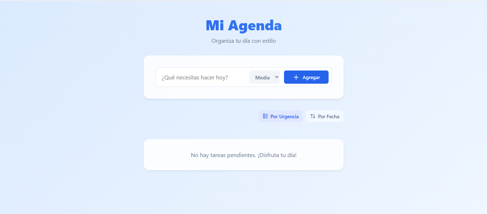

# 📝 Mi Agenda To-Do Premium

Una aplicación web moderna y elegante para gestionar tus tareas diarias, diseñada con un enfoque en la estética (Glassmorphism) y la eficiencia.




## ✨ Características Principales

*   **Gestión de Tareas**: Agrega, completa y elimina tareas con facilidad.
*   **Niveles de Urgencia**: Clasifica tus pendientes como **Alta** (Rojo), **Media** (Ámbar) o **Baja** (Verde).
*   **Persistencia en la Nube**: Tus tareas se guardan en **Supabase**, permitiendo sincronización real entre todos tus dispositivos.
*   **Diseño Dashboard**: Interfaz de "Panel de Control" con barra lateral fija y lista scrolleable, optimizada para productividad.
*   **Interacciones Avanzadas**:
    *   ✨ **Edición Directa**: Haz clic en cualquier texto para editarlo al instante.
    *   🔄 **Prioridad Dinámica**: Toca la etiqueta de urgencia para cambiarla cíclicamente.
    *   👋 **Borrado Seguro**: Confirmación antes de eliminar para evitar accidentes.
    *   🖐️ **Drag & Drop**: Arrastra y suelta tus tareas para ordenarlas manualmente.
*   **Autenticación Segura**: Sistema de inicio de sesión privado con "Link Mágico" al correo electrónico.
*   **Ordenamiento Inteligente**:
    *   📅 **Por Fecha**: Orden cronológico de creación.
    *   ⚠️ **Por Urgencia**: Prioriza automáticamente lo más importante.
*   **Acciones Masivas**: Botones rápidos para eliminar tareas completadas o limpiar toda la lista.
*   **Diseño Responsivo Inteligente**:
    *   🖥️ **Desktop**: Vista dividida (Sidebar + Lista).
    *   📱 **Móvil**: Vista apilada con controles "Sticky" (siempre a la mano).
*   **Diseño Premium**: Interfaz visual con efectos de vidrio esmerilado, animaciones suaves y tipografía moderna.

## 🚀 Cómo Usar la Aplicación

### Requisitos Previos
*   Tener instalado **Node.js** en tu computadora.
*   Un archivo `.env` configurado con tus credenciales de Supabase (URL y Anon Key).

### Instrucciones de Ejecución
1.  Abre una terminal en la carpeta del proyecto.
2.  Instala las dependencias (solo la primera vez):
    ```bash
    npm install
    ```
3.  Inicia el servidor de desarrollo:
    ```bash
    npm run dev
    ```
4.  Abre el enlace que aparece en la terminal (usualmente `http://127.0.0.1:5173/`).

## 🛠️ Tecnologías y Construcción

Esta aplicación fue construida utilizando las herramientas más modernas del desarrollo web:

*   **[React](https://react.dev/)**: Librería principal para construir la interfaz de usuario interactiva y manejar el estado de la aplicación.
*   **[Vite](https://vitejs.dev/)**: Herramienta de compilación ultrarrápida que reemplaza a Webpack.
*   **Vanilla CSS + Variables**: Estilos personalizados sin frameworks pesados, utilizando variables CSS modernas para una paleta de colores consistente y efectos de `backdrop-filter` (Glassmorphism).
*   **[Lucide React](https://lucide.dev/)**: Colección de iconos vectoriales ligeros y limpios.
*   **[Supabase](https://supabase.com/)**: Backend as a Service (BaaS) para base de datos en tiempo real y autenticación.

### Estructura del Proyecto
*   `src/components`: Contiene los bloques de construcción (`TodoForm`, `TodoList`, `TodoItem`).
*   `src/styles`: Archivos CSS modulares (`app.css` para layout, `variables.css` para el tema).
*   `src/App.jsx`: El componente principal que contiene la lógica de negocio (CRUD, ordenamiento).

---
Desarrollado por Alejandro Estrada Padilla. 2025.
